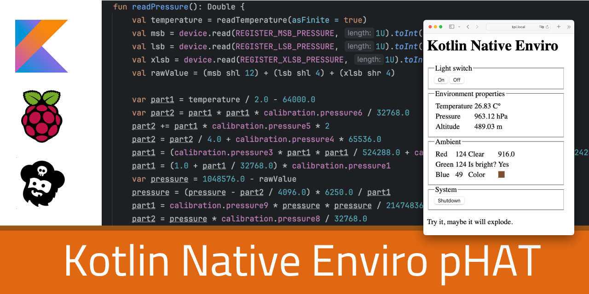
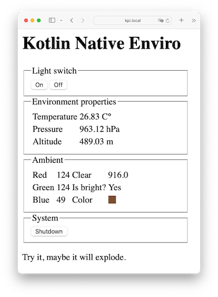
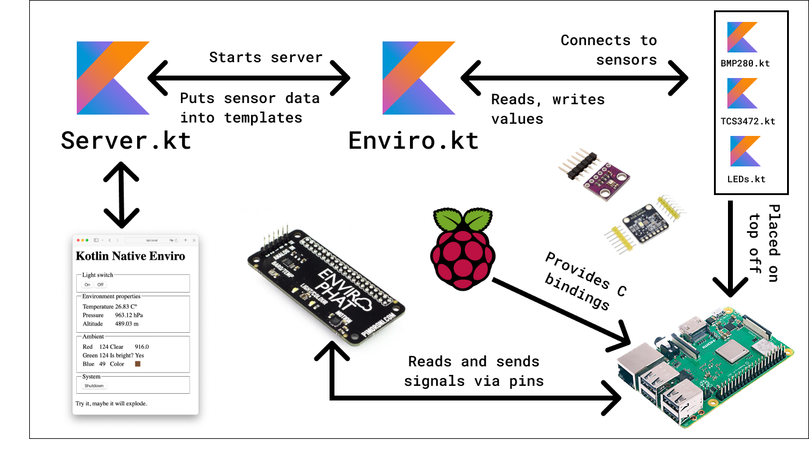

# Kpi.Enviro

> A  program to understand how to work with Kotlin Native to access GPIO and I2c pins on a Raspberry Pi with the [Enviro pHAT](https://learn.pimoroni.com/article/getting-started-with-enviro-phat) attached. It also features a Ktor-based web interface.

## tl;dr

KPi.Enviro is part of the "**K** on Raspberry **Pi**" family and a sample how to use Kotlin Native on a Raspberry Pi (64bit) to access and control attached [Pimoroni Enviro  pHAT](https://learn.pimoroni.com/article/getting-started-with-enviro-phat) using the GPIO and IC2 pins. It's build on top of the [ktgpio](https://github.com/ktgpio/ktgpio/) library. Not all sensors are used. The app accesses information of the BMP280 and TCS3472 chips.

### Other KPi projects
- [Kpi.Blinkt!](https://github.com/tscholze/kotlin-kpi-native-blinkt/) - Controlling a Pimoroni Blinkt! HAT
- [Kpi.Enviro](https://github.com/tscholze/kotlin-kpi-native-blinkt) - Reading sensor values from a Pimoroni Enviro pHAT

## Build status

| Service       |Status|
|---------------|-----|
| GitHub Action |[](https://github.com/tscholze/kotlin-kpi-native-enviro/actions/workflows/gradle-build.yml)|

## Requirements
- Pimoroni Enviro pHAT
- Raspberry Pi 3B, 4, 5
- Raspian or other 64bit Linux systems
- Run `sudo apt-get install libgpiod2 libi2c0`
- SSH connection to Raspberry Pi
- Shell host for running toolchain `*.sh` scripts

## Enviro pHAT information
The [Pimoroni Enviro pHAT](https://learn.pimoroni.com/article/getting-started-with-enviro-phat) for Raspberry Pis is an environmental sensing board that lets you measure temperature, pressure, light, color and many more.
Pimoroni provides a [Python library](https://github.com/pimoroni/enviro-phat) for reference and checks if the Kotlin Native calculations are equal to these from the vendor.

### Supported sensors and periphery
- A [BMP280](https://cdn-shop.adafruit.com/datasheets/BST-BMP280-DS001-11.pdf) temperature/pressure sensor
- A [TCS3472](https://cdn-shop.adafruit.com/datasheets/TCS34725.pdf) colour sensor, for detecting the amount and colour of light
- Two white LEDs 

### My former Enviro pHAT projects
- Python: [Enviro GDocs Logger](https://github.com/tscholze/python-enviro-gdocs-logger)
- Python: [Enviro Excel Logger](https://github.com/tscholze/python-enviro-excel-online-logger)

## How it looks
### Web


### Shell output
```bash
# ------------------------------------------ #
# Kotlin Native + Raspberry Pi + Enviro pHAT #
# ------------------------------------------ #

--- Environment reading START --
Temperature (C°): 26.891849822597578
Pressure (hPa): 963.1150683186409
Altitude (m): 489.22244179802976
--- Sample reading END ----

--- Ambient reading START --
Values in range of 0 to 255
Red: 124
Blue: 49
Green: 918.0
--- Ambient reading END ----

Press any key to quit server
```

## Scheme



## Keep in mind

### Calculations may be incorrect
In fact, the temperature will be incorrect in the means of that the sensor sits more or less directly on top of the CPU that warms the environment. The altitude is based on the [QNH of Munich](https://www.dwd.de/DE/fachnutzer/luftfahrt/teaser/luftsportberichte/qnh_sued_node.html;jsessionid=6AE20EA1CBE7EB543CB7AD6A59EACBEF.live31083). If you are outside of Germany, the altitude calculation could be way off.
Besides the placement, all values are tested but could be nevertheless incorrect. Please check algorithms and do never use these values for more than playing around with sensors.

### Not production ready
This app is purely build for educational usage! All features have room for improvements or could be done more elegant. This app was and will be never meant to run in production-like environments. 
Learning is fun!

## Contributing

This is a time-by-time sparetime project for myself. That means, no contribution is necessary but welcomed.

## Authors

Just me, [Tobi]([https://tscholze.github.io).

### Special thanks to

- [Phil](https://www.github.com/somberland) for helping me to understand some "magic" numbers in the calculations
- [Jo](https://www.github.com/dunkelstern) for helping me getting my bit overflows correct

## License

This project is licensed under the MIT License - see the [LICENSE](LICENSE) file for details.
Dependencies or assets maybe licensed differently.
